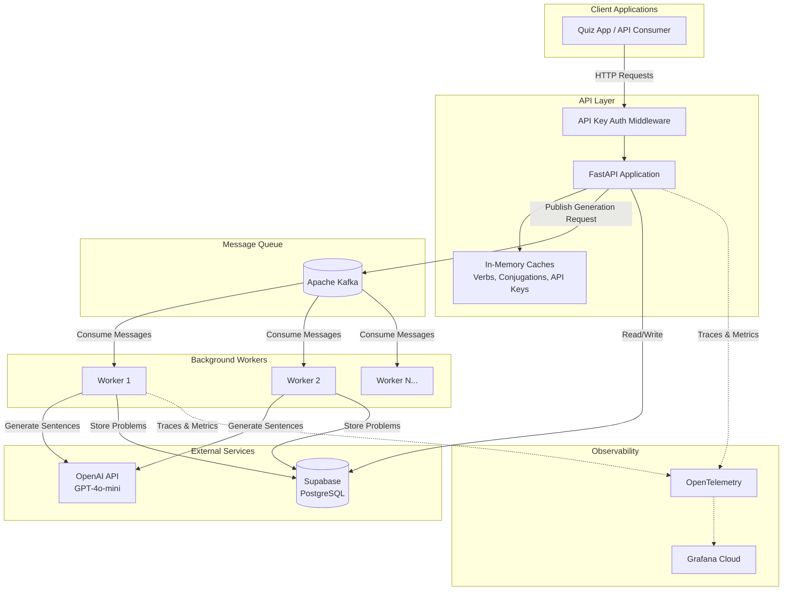
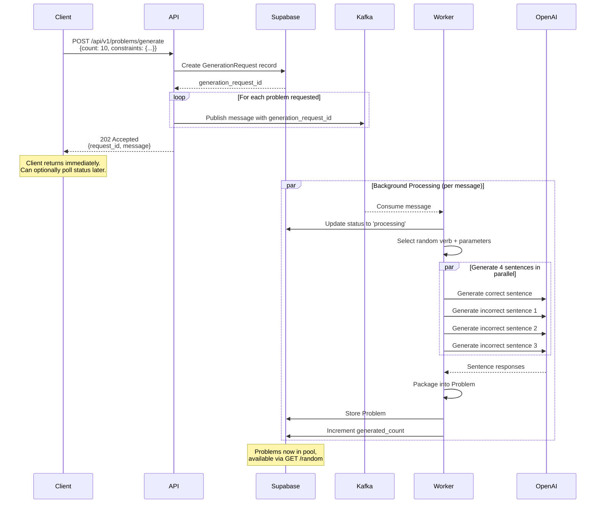
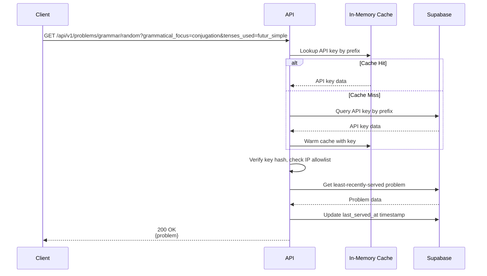
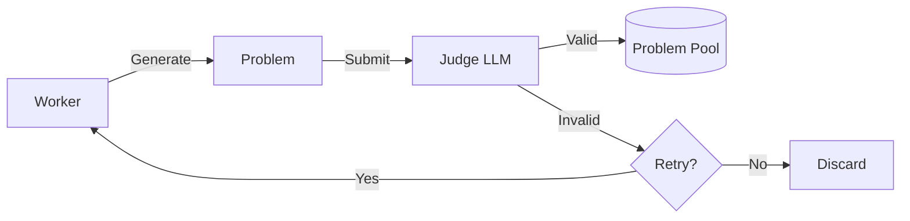

# System Architecture

Language Quiz Service is a FastAPI-based backend that generates AI-powered French grammar quiz problems. The system uses an **async generation pattern** where problem generation is decoupled from problem retrieval.

## Core Concept: Decoupled Generation and Retrieval

The system operates on a **pre-generated problem pool** model:

1. **Generation** (async): API triggers background workers to generate problems and add them to the database
2. **Retrieval** (sync): API serves problems from the existing pool using a least-recently-used (LRU) strategy

This decoupling provides:
- **Consistent retrieval latency**: ~50ms regardless of LLM processing time
- **Bulk generation**: Request many problems at once without blocking
- **Quality control**: Workers can retry failed generations without impacting API response times
- **Future judging**: Enables validation of generated content before it enters the pool (see Future Work)

---

## High-Level Architecture

---

## Problem Generation Flow

When a client requests problem generation, the API returns immediately and generation happens in the background:

### Key Points

- **Non-blocking**: The API returns `202 Accepted` immediately after publishing to Kafka
- **Parallel sentence generation**: All 4 sentences (1 correct + 3 incorrect) are generated in parallel via `asyncio.gather`, achieving ~3-4 second total generation time per problem
- **Tracking**: Each batch of messages shares a `generation_request_id` for status tracking
- **Retry handling**: Failed messages are not committed; Kafka will redeliver them

---

## Problem Retrieval Flow

Retrieving problems is synchronous and fast (~50ms):

### LRU Selection Strategy

Problems are served using weighted random selection that favors least-recently-used ordering:
- Ensures all problems get served before any repeats
- Provides variety for end users
- `last_served_at` timestamp updated on each retrieval
- Supports filtering by `grammatical_focus`, `tenses_used`, `topic_tags`, and `target_language_code`
- Filters are applied before LRU selection, ensuring filtered results still benefit from staleness weighting

---

## In-Memory Caching

Caches use a **write-through** pattern with database fallback on reads:

| Operation | Behavior |
|-----------|----------|
| **Read** | Cache-first; on miss, query DB and warm cache for next time |
| **Create** | Write to DB first, then `refresh_key()` to update cache |
| **Update** | Write to DB first, then `refresh_key()` to update cache |
| **Delete** | Write to DB first, then `invalidate_key()` to remove from cache |

### Cache Types

| Cache | Index Keys | Purpose |
|-------|------------|---------|
| **Verb Cache** | ID, infinitive | Fast verb lookups for sentence generation |
| **Conjugation Cache** | Verb infinitive + auxiliary | All verb forms for grammar problems |
| **API Key Cache** | ID, prefix, hash | Authentication hot path optimization |

### Cache Management

- **Stats endpoint**: `GET /api/v1/cache/stats` returns hit rates and counts
- **Manual refresh**: For cases where direct database modifications are made outside the API (e.g., via Supabase dashboard)

---

## Component Details

### API Layer (`src/api/`)

| Endpoint | Method | Purpose |
|----------|--------|---------|
| `/api/v1/problems/grammar/random` | GET | Retrieve LRU grammar problem from pool with optional filters (grammatical_focus, tenses_used, topic_tags) |
| `/api/v1/problems/generate` | POST | Trigger async problem generation |
| `/api/v1/problems/{id}` | GET | Retrieve specific problem by ID |
| `/api/v1/generation-requests/{id}` | GET | Check generation request status |
| `/api/v1/verbs/random` | GET | Get random verb (testing/exploration) |
| `/api/v1/api-keys/` | GET/POST | API key management (admin only) |
| `/api/v1/cache/stats` | GET | Cache statistics |

### Background Workers (`src/worker/`)

Workers run as asyncio tasks within the FastAPI process (configured via `WORKER_COUNT` environment variable):

- All workers join the same Kafka consumer group
- Kafka automatically distributes partitions among workers
- Each worker processes one message at a time with manual offset commits
- OpenTelemetry trace context propagates from API request through worker processing

### Services Layer (`src/services/`)

| Service | Responsibility |
|---------|----------------|
| `ProblemService` | Orchestrates problem generation, packages sentences into problems |
| `SentenceService` | Generates sentences via OpenAI using compositional prompts |
| `VerbService` | Provides verb data and conjugations (from cache or DB) |
| `QueueService` | Publishes generation requests to Kafka |
| `GenerationRequestService` | Tracks async generation request status |
| `ApiKeyService` | Authentication, key management, cache coordination |

### Prompt System (`src/prompts/`)

The **compositional prompt system** generates targeted grammatical errors for quiz problems:

- **Correct sentence prompt**: Enforces all French grammar rules
- **Incorrect sentence prompts**: Each targets ONE specific error type:
  - Auxiliary verb errors (avoir/être)
  - Past participle agreement errors
  - Reflexive pronoun errors
  - Negation structure errors
  - Object pronoun placement errors
  - And more...

Error types are selected based on the verb properties and grammatical parameters, ensuring relevant and pedagogically useful incorrect options.

---

## Data Flow Summary

| Flow | Latency | Description |
|------|---------|-------------|
| Problem retrieval | ~50ms | Fetch from pre-generated pool (LRU) |
| Trigger generation | ~100ms | Create tracking record, publish to Kafka, return |
| Problem generation | ~3-4s/problem | Worker processes message, calls OpenAI 4x in parallel |
| Status polling | ~50ms | Query generation_requests table |

---

## Deployment Architecture

The service runs on Fly.io:

| Component | Fly App | Description |
|-----------|---------|-------------|
| API + Workers | `language-quiz-app-{env}` | FastAPI with embedded background workers |
| Kafka | `language-quiz-kafka-{env}` | Message broker for async jobs |

External services:
- **Supabase**: Managed PostgreSQL database (separate project per environment)
- **Grafana Cloud**: Observability (traces, metrics, dashboards)
- **OpenAI**: LLM API for sentence generation

---

## Key Design Decisions

### 1. Embedded Workers vs. Separate Service

Workers run in the same process as FastAPI for simplicity. Trade-offs:
- **Pro**: Single deployment, shared caches, simpler operations
- **Con**: Workers compete with API for resources
- **Future**: Can extract to separate service if scaling requires it

### 2. LRU Problem Selection

Ensures all problems get served before any repeats:
- Provides variety for end users
- Simple to implement with `last_served_at` timestamp
- Could be extended with filters (by topic, difficulty, etc.)

### 3. Fire-and-Forget Problem Storage

Problems are returned to the API caller immediately while database write happens in background:
- Reduces perceived latency
- Acceptable for non-critical write (problem already generated)
- Worker will retry if initial storage fails

### 4. Compositional Prompts

Each incorrect sentence targets a specific grammatical error type:
- More predictable error generation vs. asking LLM to "make mistakes"
- Explanations match the actual errors introduced
- Easier to debug and tune individual error types

---

## Future Work: Problem Judging

The async generation flow enables a **problem judging** pipeline (not yet implemented):

Benefits:
- Validates grammatical correctness of "correct" sentences
- Verifies incorrect sentences contain the intended error
- Filters out low-quality or confusing problems
- All happens async, no impact on retrieval latency

