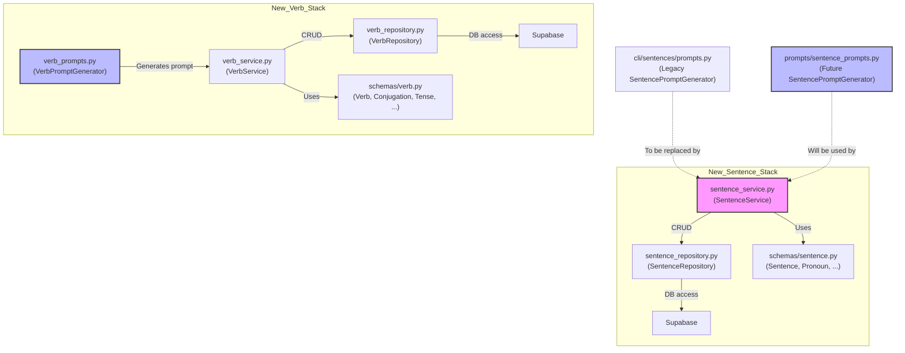

# Sentence & Verb Stack Architecture

```mermaid
flowchart TD
    subgraph New_Verb_Stack
        A1["verb_prompts.py\n(VerbPromptGenerator)"] -->|"Generates prompt"| A2["verb_service.py\n(VerbService)"]
        A2 -->|"CRUD"| A3["verb_repository.py\n(VerbRepository)"]
        A3 -->|"DB access"| A4["Supabase"]
        A2 -->|"Uses"| A5["schemas/verb.py\n(Verb, Conjugation, Tense, ...)"]
    end

    subgraph New_Sentence_Stack
        B1["sentence_service.py\n(SentenceService)"] -->|"CRUD"| B2["sentence_repository.py\n(SentenceRepository)"]
        B2 -->|"DB access"| B3["Supabase"]
        B1 -->|"Uses"| B4["schemas/sentence.py\n(Sentence, Pronoun, ...)"]
        style B1 fill:#f9f,stroke:#333,stroke-width:2px
    end

    classDef promptGen fill:#bbf,stroke:#333,stroke-width:2px;
    class A1 promptGen;

    %% Legacy prompt generator (to be replaced)
    C1["cli/sentences/prompts.py\n(Legacy SentencePromptGenerator)"]
    C1 -.->|"To be replaced by"| B1

    %% Future
    D1["prompts/sentence_prompts.py\n(Future SentencePromptGenerator)"]
    D1 -.->|"Will be used by"| B1
    class D1 promptGen;
```

**Legend:**
- Blue = Prompt generator
- Purple = Service layer
- Arrows = data or control flow
- Dashed = planned/legacy connections 