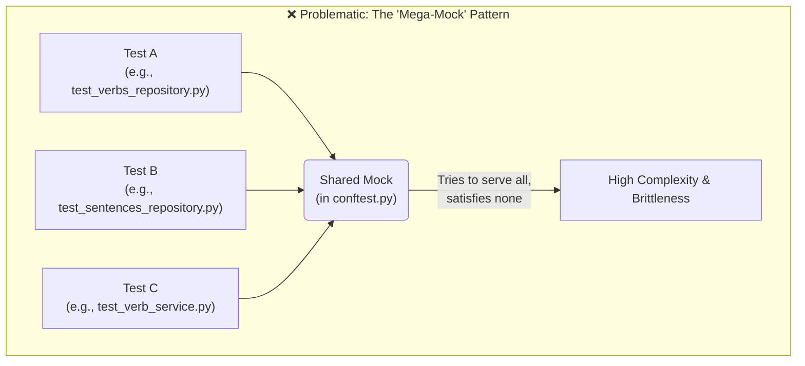
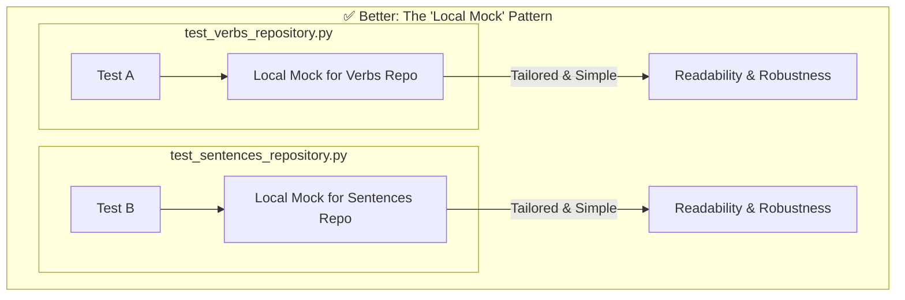

# Testing Strategy: Local and Specific Mocks

This document outlines our agreed-upon strategy for mocking dependencies in tests. The goal is to create a test suite that is robust, readable, and easy to maintain.

## The Problem: The "Mega-Mock" Anti-Pattern

Previously, we centralized complex mocks in a single `tests/conftest.py` file. While this seems to follow the DRY (Don't Repeat Yourself) principle, it led to several significant problems:

1.  **Brittleness**: A single mock had to cater to the needs of every test. A change made to satisfy one test often had unintended consequences, breaking dozens of others.
2.  **Complexity**: The mock itself became a complicated piece of software that was difficult to understand and debug.
3.  **Lack of Clarity**: When a test failed, the cause was often hidden away in the `conftest.py` file, far from the test code itself, making it difficult to trace the interaction.

This is represented by the following diagram:

## The Solution: Local and Specific Mocks

To avoid these issues, our strategy is to **define mocks as close to the tests that use them as possible.**

### Guiding Principles

1.  **Prefer Local Mocks**: Mocks, especially for complex objects like database clients or external APIs, should be defined as fixtures within the test file that uses them (e.g., inside `test_verbs_repository.py`).
2.  **Mocks Should Be Specific**: A mock should only replicate the specific methods and return values required for the tests in that file. It should not be a complete, general-purpose replica of the object.
3.  **Keep `conftest.py` for Simple, Shared Data**: The root `tests/conftest.py` is still valuable. It should be used for simple, stable, and truly shareable fixtures, such as:
    *   Sample data models (e.g., a `sample_verb` dictionary).
    *   Configuration objects.
    *   Simple, stateless helper functions.

This approach leads to a much cleaner and more maintainable structure:

By adhering to this strategy, our tests will become more self-contained, easier to read, and far less likely to break unexpectedly. 